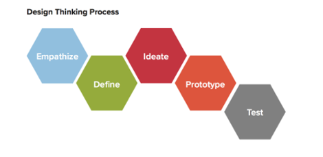

# "HEALTH CARE RECORDS"
***
Esta plataforma le permite al médico, administar sus consultas y revisar el historial de sus pacientes, de una manera fácil y eficiente.

**Presentación del reto:**

Crear un dashboard (aplicación web) para un médico internista/generalista.

## OVERVIEW

El objetivo del proyecto es proporcionar una aplicación intuitiva que permita a los médicos consultar el historial clínico de sus pacientes, organizar sus consultas y visualizar la información mas relevante de los mismos.

El proceso de diseño, esta basado en la metología ***Design thinking***.

## 1. ETAPA DE DESCUBRIMIENTO
### 1.1 DATOS CUANTITATIVOS
Se realizo una encuesta para conocer  más de cerca cual es la experiencia y opinión de los médicos con el manejo de historiales y organización de citas.

Encuesta en línea:
[Ver aquí](https://goo.gl/forms/zjMvCLSVRTAsMq9J2)

### 1.2 BENCHMARKING

Se encontraron algunos sitios web que ya cumplen algunas funciones respecto al manejo de historiales electronicos.

## 2. ETAPA DE IDEACIÓN
### 2.1 User Person

